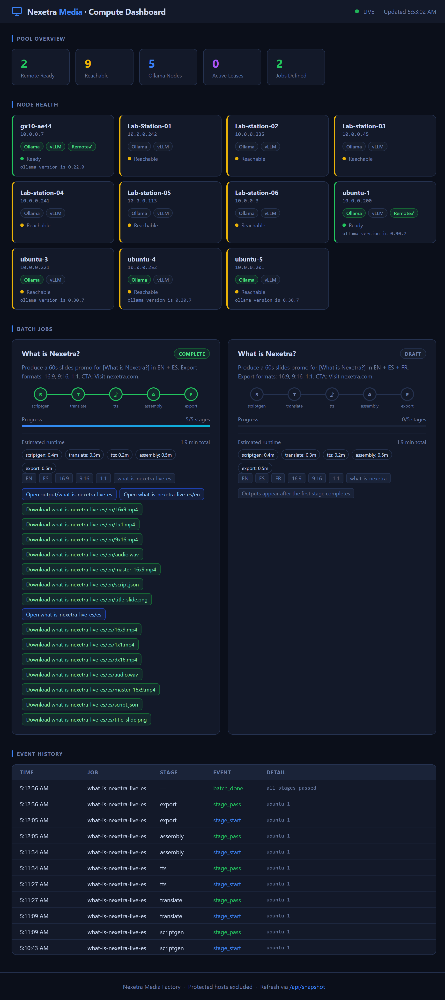
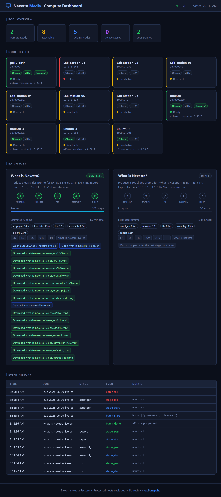

# Nexetra Media E2E Test Manual (2026-06-09)

## Purpose
This manual documents a complete end-to-end validation run of the Nexetra Media pipeline and dashboard, including screenshots and reproducible commands.

## Test Summary
- Date: 2026-06-09
- Dashboard URL: http://10.0.0.200:7800
- Validated pipeline path: local orchestrator (`pipeline/run_job.py`) with DGX-backed translation and full media export
- Result: Success

## Screenshot Set
- Baseline dashboard: `docs/screenshots/e2e-2026-06-09/01-dashboard-before.png`
- In-progress dashboard capture: `docs/screenshots/e2e-2026-06-09/02-dashboard-during.png`
- Post-run dashboard: `docs/screenshots/e2e-2026-06-09/03-dashboard-after.png`

### Embedded Screenshots





## Preconditions
1. Activate the repo virtual environment at `nexetra-media/.venv`.
2. Confirm dashboard service is running on `ubuntu-1`.
3. Confirm `jobs/what-is-nexetra-live-es.json` exists.

## E2E Execution Steps
1. Open a terminal in `nexetra-media`.
2. Run the end-to-end pipeline:

```powershell
.\.venv\Scripts\python pipeline\run_job.py --job jobs\what-is-nexetra-live-es.json
```

3. Confirm all stages pass:
- `scriptgen`
- `translate`
- `tts`
- `assembly`
- `export`

4. Expected final line:
- `Pipeline completed successfully.`

## Verified Stage Output (From Run)
- Script generation wrote `output/what-is-nexetra-live-es/en/script.json`
- Translation wrote `output/what-is-nexetra-live-es/es/script.json`
- TTS wrote WAV files for EN and ES
- Assembly wrote `master_16x9.mp4` for EN and ES
- Export wrote `16x9.mp4`, `9x16.mp4`, and `1x1.mp4` for EN and ES

## Output Locations
- Run root: `output/what-is-nexetra-live-es`
- English assets: `output/what-is-nexetra-live-es/en`
- Spanish assets: `output/what-is-nexetra-live-es/es`
- Dashboard history/state:
  - `output/job_runs.jsonl`
  - `output/compute_pool/health-latest.json`
  - `output/compute_pool/leases.json`

## Dashboard Validation Checklist
1. Open http://10.0.0.200:7800
2. In Batch Jobs, confirm job cards show:
- stage progress
- estimated runtime per stage
- estimated total runtime
- direct links to open output folders and download assets
3. Open at least one folder link and one download link to validate routing.

## Notes
- A separate pool-orchestrated run with a temporary new job file failed because that job file did not exist on the remote execution anchor host.
- The final validated E2E result in this manual is from the successful full local orchestration run shown above.
